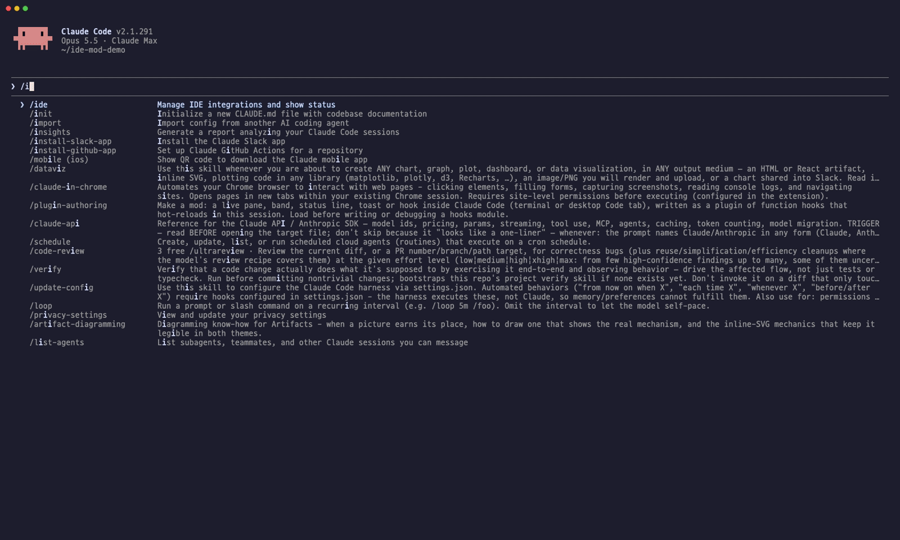

# ide-mod

Claude Code 안에 IDE 창을 띄우는 모드(function-hooks 플러그인)예요. 창 위쪽에는 **에이전트 보드**가, 아래쪽에는 **파일 트리와 탭 에디터**가 있어요. 탭에서 **HWP·HWPX·PDF 문서**를 쪽 모양 그대로 열어 보고, 왼쪽 칸을 **이번 세션의 요청 기록**으로 바꿔 볼 수 있어요. 입력창 위에는 **강의 자막**과 **한국어 문체 게이트**가 떠요.



<sub>데모 녹화: [`docs/demo.tape`](docs/demo.tape) ([VHS](https://github.com/charmbracelet/vhs)) · 샘플 문서는 행정안전부 「2025년 주요업무 추진계획」(공공 문서)</sub>

```
에이전트 ● opus 5.5 1M · xhigh · 서브 1개 작업 중 / 1개 끝남   a: 보드 접기  h: 끝난 것 숨기기  s: 요약 끄기(haiku)  x: 끝난 것 지우기
● 메인  opus 5.5 1M · xhigh  작업 중 3m12s · 도구 14  로그인 버그 고쳐줘
  요약 인증 흐름을 서브에이전트에 나눠 조사하는 중
├─ ● Explore  haiku 4.5  작업 중 34s · 도구 6  인증 코드 찾기
│    지금 Grep  login
└─ ✓ general-purpose  sonnet 5.5 · medium  완료 1m02s  테스트 작성
     결과 login.test.ts에 실패 케이스 3개 추가
──────────────────────────────────────────────────────────────────────────────
t: 트리 접기  u: 상위 폴더  r: 새로고침  p: @프롬프트  c: 경로 복사  w: 탭 닫기
my-project  1-24/57   k ▲ j ▼ │ ▎app.ts ●   README.md
▾ src/                        │ src/app.ts · 1.2 KB · 1-21/88줄
    ▾ auth/                ●  │  1 import { login } from './auth'
        login.ts           ●  │  2
    app.ts                 ●  │  3 export const answer = 42
▸ tests/                      │  …
  README.md                   │
```

## 설치

Claude Code 터미널 세션에서 아래 한 줄을 입력하세요.

```
/plugin install ide-mod --marketplace jkf87/ide-mod
```

마켓플레이스를 추가할지 물으면 `y`를 누르고 범위(user 권장)를 고르면 돼요. 설치한 세션에서 바로 동작해요.

> function hooks는 Claude Code의 early access API예요. 2.1.290에서 만들고 시험했어요. 버전이 바뀌면 API가 달라질 수 있어요.

## 쓰는 법

| 명령 | 하는 일 |
|---|---|
| `/ide` | IDE 창을 열어요 (처음엔 작업 폴더) |
| `/open <경로>` | 폴더면 트리의 뿌리로, 파일이면 탭으로 열어요. `~`, 상대 경로, `@경로` 모두 돼요 |
| `/lecture [on\|off]` | 강의 모드: Claude가 하는 일을 입력창 위에 쉬운 한국어 자막으로 보여줘요 |
| `/handoff [세션 이름] [메모]` | 이 세션을 다른 에이전트 세션에 넘겨요. 이름을 주면 그 세션에 핸드오프 글을 바로 보내고, 없으면 글을 보여 주고 핸드오프 화면을 열어요 |
| `/style-gate [파일\|on\|off]` | 한국어 원고의 AI티 지표를 검사해요. 켜 두면 Claude가 `.md`·`.txt`를 쓸 때마다 자동으로 검사해요 |

전체 화면 레이아웃(fullscreen)에서 쓰면 창이 대화 옆에 넓게 붙어서 IDE처럼 보여요. 창 크기는 직접 끌어서 바꿀 수 있어요.

### 에이전트 보드 (위쪽)

- 메인 에이전트와 서브에이전트를 **누가 누구를 띄웠는지에 따라 트리로** 보여줘요. 팀원이나 손자 에이전트까지 나와요.
- 에이전트마다 **모델·effort**(실제로 보낸 모델 요청 기준), **역할**(서브에이전트 타입, 팀원 이름), **맡은 작업**, **지금 하는 일**(마지막 도구 호출), 경과 시간과 도구 호출 수를 보여줘요.
- **요약**: 보드가 화면에 떠 있을 때만 20초마다 새 활동이 쌓인 에이전트를 haiku로 한 줄 요약해요. 끝난 에이전트는 답의 첫 줄을 보여줘요.
  - 요약은 계정 사용량을 써요(20초에 최대 3번, 짧은 호출). `s`로 끌 수 있고, 3번 연속 실패하면 스스로 꺼져요.
- 서브에이전트가 돌 때는 상태줄에 `◆ opus 5.5 · xhigh  ⇉ 서브에이전트 N개 작업 중`이 떠요.
- 단축키: `i` 핸드오프, `a` 보드 접기/펼치기, `h` 끝난 것 숨기기(돌고 있는 자손은 남아요), `s` 요약 켜기/끄기, `x` 끝난 것 지우기

### 탐색기 (아래쪽)

- 폴더(▸)를 누르면 그 자리에서 펼쳐지고, 파일을 누르면 오른쪽에 탭으로 열려요. 탭은 최대 8개예요. 심볼릭 링크 폴더도 펼쳐져요.
- 코드는 문법 하이라이트와 줄 번호로 보여줘요. 마크다운은 `m`을 누르면 렌더 화면으로 바뀌어요.
- **스크롤**: 휠은 마우스가 올라간 쪽(트리 또는 파일)만 움직여요. 방향키는 열린 파일을 움직이고, 열린 파일이 없으면 트리를 움직여요. `j`/`k`는 트리를 반 화면씩 넘겨요.
- **Claude가 고친 파일**은 트리와 탭에 `●`이 붙고, 열려 있으면 다시 읽어요. 거절되거나 실패한 수정은 표시하지 않아요.
- 폭이 70칸보다 좁으면 트리와 파일을 번갈아 보여줘요. 파일을 고르면 파일 화면으로 넘어가고, `t`를 누르면 트리로 돌아와요.
- 단축키: `t` 트리 접기, `q` 파일 트리/요청 기록, `l` 요청 모두 보기/하나만, `u` 상위 폴더, `r` 새로고침, `m` 렌더/원문, `v` HWP 문서/그림 보기, `o` HWP 미리보기로 열기, `b`·`n` HWP 앞뒤 쪽, `p` 입력창에 `@경로` 넣기, `c` 경로 복사, `w` 탭 닫기

### HWP·HWPX·PDF 뷰어 (rhwp·pdf.js 엔진)

- 트리에서 `.hwp`·`.hwpx`·`.pdf`를 누르면 탭으로 열려요. HWP 엔진은 [rhwp](https://github.com/edwardkim/rhwp)(Rust→WASM, MIT, `vendor/rhwp`), PDF 엔진은 [pdf.js](https://github.com/mozilla/pdf.js)(Apache-2.0, `vendor/pdfjs`)예요. 둘 다 같은 문서 보기 렌더러(`bin/grid.mjs`)를 써요.
- PDF는 pdf.js가 꺼낸 글자 좌표와 선(획·얇은 막대)으로 문서 보기를 만들고, 그림 보기는 poppler의 `pdftoppm`으로 만들어요(`brew install poppler`). `o`는 PDF 원본을 미리보기로 바로 열어요.
- **문서 보기**(기본): rhwp가 그린 쪽을 창 너비에 맞춘 글자 격자로 다시 그려요. 가운데 정렬 제목, 번호 상자, 표 테두리(┌┬┐├┼┤└┴┘), 굵은 글씨, 글자색, 가운뎃점을 쪽 모양 그대로 보여주고, 칸을 넘는 글은 `…`로 줄여요. 그래픽이 없는 터미널(macOS 터미널 등)에서도 HWP 모양으로 보여요. 쪽 끝까지 내리면 다음 쪽으로 넘어가요.
- **그림 보기**(`v`): rhwp가 그린 실제 쪽 그림이에요. 터미널은 PNG(kitty·Ghostty 같은 그래픽 터미널), 데스크톱 앱은 SVG로 그려요.
- **미리보기로 열기**(`o`): 지금 쪽을 그림으로 만들어 macOS 미리보기로 열어요. 한컴에서 보는 모양 그대로 확인할 때 써요.
- `b`/`n`으로 앞뒤 쪽을 넘기고, 치환이 안 된 `{{키}}` 칸은 빨갛게 표시하고 개수를 위에 보여줘요.
- 엔진은 플러그인의 `bin/rhwp-view.mjs`를 **Node.js**로 실행해요. 그림 변환은 `rsvg-convert` → `resvg` → macOS `qlmanage`+`sips` 순서로 있는 것을 써요.

### 핸드오프 (`i`)

- 보드 맨 위에 이 세션의 ID(앞 8자리)가 떠요. `i`를 누르면 탐색기가 핸드오프 화면으로 바뀌어요.
- 왼쪽에는 지금 열려 있는 다른 Claude 세션(데스크톱 앱·터미널)이 나와요. 세션을 누르면 오른쪽 핸드오프 글을 그 세션에 메시지로 보내요. `r`로 목록을 새로 받아요.
- 핸드오프 글에는 세션 ID, 작업 폴더, 대화 기록 파일 경로, 이어서 여는 명령(`claude --resume <ID> --fork-session`), **사용자가 보낸 요청**(최근 20개, 시각과 함께), 에이전트가 마지막에 하던 일이 들어가요. 받은 쪽은 대화 기록을 읽고 이어서 일해요.
- `c` 핸드오프 글 복사(Codex 같은 다른 에이전트에 붙여 넣을 때), `y` 세션 ID만 복사, `e` 이어서 열기 명령 복사.
- 세션 목록은 Claude Code의 ListAgents 도구로 받고, 보내기는 `$.session.send`를 써요.

### 요청 기록 (`q`)

- 이번 세션에서 **사람이 보낸 요청**(입력창·원격 조종·SDK)이 번호·시각·상태(● 진행 중, ✓ 끝남, ■ 중단)와 함께 왼쪽 칸에 쌓여요. 백그라운드 작업 알림이나 다른 세션이 보낸 메시지는 넣지 않아요. 최근 요청이 맨 위예요.
- **모두 보기**(기본): 오른쪽 칸에 이번 세션 요청 전부를 전문 그대로 이어서 보여 줘요. 요청마다 시각·상태·걸린 시간과 Claude 답의 첫 줄이 붙어요. 내가 무슨 말을 했는지 한눈에 훑어볼 때 써요. `c`로 전부 복사해요.
- 요청을 누르면 그 요청 하나만 펼쳐요. `p`로 입력창에 다시 넣고, `c`로 복사해요. `l`로 모두 보기와 하나만 보기를 오가요.
- 세션별로 저장돼서 모드를 다시 불러오거나 세션을 이어 열어도 남아요. 최근 40개 세션까지 보관해요.

### 입력창 위: 강의 자막과 문체 게이트

- **강의 자막**(`/lecture`): "파일을 읽고 있어요 · login.ts", "터미널에서: 테스트 실행"처럼 지금 하는 일과 방금 한 일, 단계 수, 경과 시간, 일하는 서브에이전트 수를 테두리 상자에 보여줘요. 모델 호출 없이 도구 호출만으로 만들어요.
- **문체 게이트**(`/style-gate`): noslop-ko의 결정적 패턴 16개(대조 구문, 접속어 뒤 쉼표, 맺음 상투어, 과장 어휘, 번역투 등)를 세서 통과·경고·중단을 판정해요. 경고 이상이면 입력창 위에 뜨고, `g`로 예문을 펼치고 `d`로 닫아요. 한글이 50자 넘는 원고만 검사하고 코드 블록은 빼요.
- 다른 모드가 입력창 위에 그리는 띠(예: usage-band)는 그 아래에 그대로 둬요.

패널에 포커스가 있을 때(클릭하거나 ctrl+x tab) 단축키가 먹어요. Esc를 누르면 입력창으로 돌아가요.

## 한계

- **보기 전용**이라 편집은 Claude에게 시키거나 실제 에디터에서 하세요.
- **이미지**: PNG만, kitty·Ghostty처럼 그래픽 프로토콜을 지원하는 터미널에서만 보여요. HWP 페이지 그림도 같아요.
- **HWP**: Node.js가 있어야 해요. 데스크톱 앱은 쪽 SVG를 줄여서(글꼴 목록을 스타일 한 줄로, 좌표 소수 한 자리) 그리는데, 그래도 128K자를 넘는 쪽은 문서 보기를 써요.
- **큰 파일·폴더**: 4 MB가 넘는 파일은 열지 않아요. 트리는 3,000줄까지만 펼쳐요.
- **렌더된 마크다운**은 문단 단위로 스크롤돼요.
- **바깥 수정**: Claude 밖(내 에디터)에서 고친 파일은 `r`을 누르거나 다음에 다시 그려질 때 반영돼요.
- **UI 언어**: 화면 문구는 한국어예요.

## 개발

```
claude plugin validate .     # 매니페스트·훅 모듈 검사
claude plugin test .         # tests/*.test.tsx
claude --plugin-dir .        # 이 폴더를 그대로 로드해서 써 보기
```

타입 정의(`.claude-plugin/types/`)와 `tsconfig.json`은 Claude Code가 이 폴더를 한 번 로드할 때 깔아 줘요. 그 뒤에 `npx tsc -p .`로 타입 검사를 할 수 있어요. 둘 다 `.gitignore`에 들어 있어요.

구조는 `hooks/register.tsx` 파일 하나예요. 엔진이 `$`를 같은 파일 안의 함수로만 따라가서, 보드와 탐색기를 한 파일에 나눠 적었어요.

## License

MIT. 함께 들어 있는 rhwp(`vendor/rhwp`)는 Edward Kim의 MIT 라이선스, pdf.js(`vendor/pdfjs`)는 Mozilla의 Apache-2.0 라이선스예요.
